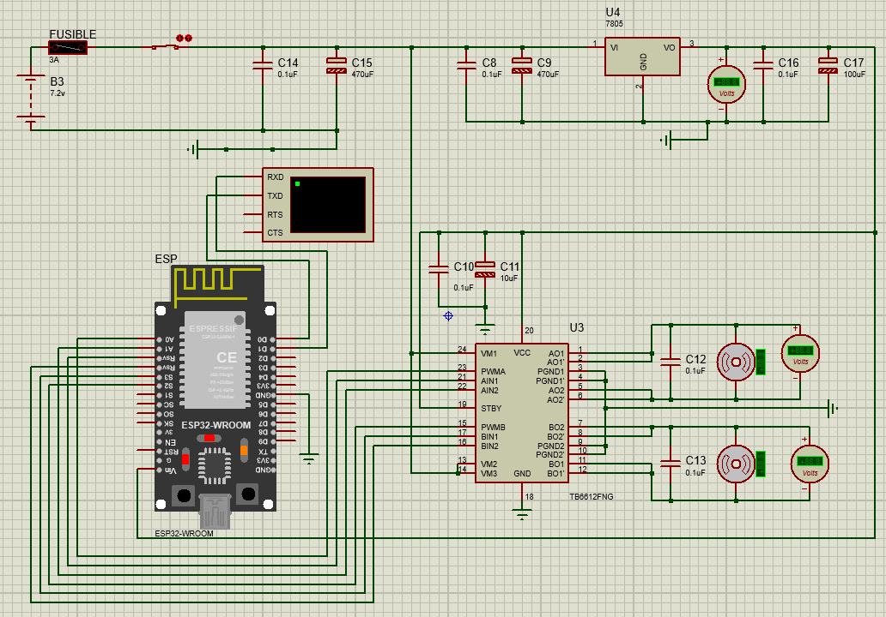

# 🐂 PITBULL V2.0.0

Sistema de control y desarrollo de un robot SoccerBot basado en **ESP32**, con control mediante interfaz web, comunicación Wi-Fi, simulación electrónica en **Proteus**, programación mediante **Arduino IDE** y modelo 3D para fabricación del chasis.

---

# 📑 Índice

- [Descripción del proyecto](#-descripción-del-proyecto)
- [Estructura del repositorio](#-estructura-del-repositorio)
- [Estructura del proyecto](#-estructura-del-proyecto-1)
  - [Electrónica](#-electrónica)
  - [Código](#-código)
  - [Modelo 3D](#-modelo-3d)
- [Simulación en Proteus](#-simulación-en-proteus)
  - [Esquema electrónico](#-esquema-electrónico)
  - [Instalación de la librería ESP32 en Proteus](#-instalación-de-la-librería-esp32-en-proteus)
  - [Consideraciones sobre la simulación](#-consideraciones-sobre-la-simulación)
  - [Equivalencia de pines](#-equivalencia-de-pines)
  - [Obtención del archivo HEX](#-obtención-del-archivo-hex)
  - [Carga del binario en Proteus](#-carga-del-binario-en-proteus)
- [Código del SoccerBot](#-código-del-soccerbot)
- [Documentación del código](#-documentación-del-código)
  - [Librerías](#1-librerías)
  - [Configuración de red](#2-configuración-de-red)
  - [Asignación de pines](#3-asignación-de-pines)
  - [Watchdog de seguridad](#4-watchdog-de-seguridad)
  - [Interfaz web](#5-interfaz-web)
  - [Control de motores](#6-control-de-motores)
  - [Cinemática Arcade Drive](#7-cinemática-arcade-drive)
  - [Servidor HTTP](#8-servidor-http)
  - [Sistema de secuencia](#9-sistema-de-secuencia)
  - [OTA](#10-actualización-ota)
  - [Loop principal](#11-loop-principal)
- [Flujo general del sistema](#-flujo-general-del-sistema)
- [Modelo 3D](#-modelo-3d-1)
- [Funcionamiento general](#-funcionamiento-general)
- [Consideraciones importantes](#-consideraciones-importantes)
- [Referencias](#-referencias)

---

#  Descripción del proyecto

**PITBULL V2.0.0** es un proyecto de robótica móvil orientado al desarrollo de un **robot SoccerBot**.

El proyecto integra tres áreas principales:

1. **Electrónica**
2. **Programación y control**
3. **Diseño mecánico y fabricación 3D**

El sistema utiliza un **ESP32** como unidad principal de control. El robot puede recibir comandos mediante una interfaz web alojada directamente en el ESP32 utilizando una red Wi-Fi creada por el propio dispositivo.

El proyecto también cuenta con una simulación electrónica desarrollada en **Proteus**, que permite comprobar previamente el funcionamiento lógico del sistema antes de llevarlo al hardware físico.

---

# 📁 Estructura del repositorio

La estructura general del repositorio es la siguiente:

```text
PITBULL-V2.0.0/
│
├── README.md
│       └── Documentación principal del repositorio
│
├── codigo/
│       └── Firmware en C/C++ para Arduino IDE
│
├── electronica/
│       ├── SOCCER 3.0.pdsprj
│       │       └── Esquemático y simulación de Proteus
│       │
│       └── libreria_proteus/
│               ├── ESP32TEP.LIB
│               └── ESP32TEP.IDX
│
├── imagenes/
│       └── Capturas, diagramas de flujo e instrucciones visuales
│
└── modelo_3d/
        └── Archivos CAD (.STL, .STEP) para el chasis```

🏗️**structura del proyecto**

Avanzaremos inicialmente por las partes principales del proyecto.


⚡ Electrónica

El esquema electrónico general del proyecto se encuentra representado en Proteus.

Diagrama general




El esquema muestra la conexión general de los componentes electrónicos utilizados en el SoccerBot.

📂 Archivos de la simulación

Los archivos principales de la simulación se encuentran en:
/home/tronyx/PITBULL-V2.0.0/electronica/


Dentro de esta carpeta se encuentran principalmente:

1. SOCCER 3.0.pdsprj

Este archivo contiene el proyecto y el esquemático desarrollado en Proteus.

Es el archivo que debe abrirse para acceder a la simulación electrónica.

2. codigo_simulacion_proteus.ino


Este archivo contiene el código utilizado para la simulación.

Puede abrirse mediante Arduino IDE para realizar modificaciones, compilarlo y posteriormente generar el archivo binario necesario para Proteus.


🧩 Librería ESP32 para Proteus

Los componentes utilizados en el esquemático se encuentran principalmente dentro del archivo:

SOCCER 3.0.pdsprj

La excepción corresponde al componente ESP32, debido a que se utiliza una librería externa.

La librería del ESP32 se encuentra dentro del repositorio en:

/home/tronyx/PITBULL-V2.0.0/electronica/libreria_proteus/

Esta carpeta contiene dos archivos:

ESP32TEP.LIB
ESP32TEP.IDX

Estos archivos deben instalarse manualmente en la carpeta correspondiente de Proteus.


🔧 Instalación de la librería ESP32 en Proteus

Para añadir la librería ESP32 a Proteus:

1. Localizar los archivos

Dentro del repositorio se encuentran los siguientes archivos:

/home/tronyx/PITBULL-V2.0.0/electronica/libreria_proteus/

Allí se encuentran:

ESP32TEP.LIB
ESP32TEP.IDX

2. Localizar la carpeta de librerías de Proteus

Busca en tu instalación de Proteus la carpeta donde se encuentran sus librerías.

La ubicación exacta puede variar dependiendo de la versión e instalación de Proteus.

Para localizarla puedes utilizar como referencia la siguiente imagen:


3. Copiar los archivos

Copia los dos archivos:

ESP32TEP.LIB
ESP32TEP.IDX

dentro de la carpeta:

Libraries

de Proteus.

4. Reiniciar Proteus

Después de copiar los archivos:

Cierra Proteus.
Vuelve a abrir Proteus.
Abre nuevamente el proyecto.
Busca el componente ESP32.

Si todo se realizó correctamente, el componente debería estar disponible.

⚠️ Si el componente ESP32 no aparece

Si el componente no aparece después de instalar la librería:

Verifica que los archivos .LIB y .IDX estén en la carpeta correcta.
Comprueba que Proteus haya sido cerrado antes de copiar los archivos.
Reinicia Proteus.
Comprueba que el archivo del proyecto siga utilizando el componente correcto.

Si el archivo de Proteus fue trasladado de ubicación, revisa también las rutas asociadas al proyecto.


📚 Referencia para instalar librerías

Para obtener información adicional sobre la instalación y configuración de librerías en Proteus:

https://www.theengineeringprojects.com/2018/04/how-to-add-new-library-in-proteus-8.html
⚠️ Consideraciones sobre la simulación

Aunque el componente utilizado en Proteus pueda representar físicamente un ESP32, la simulación utiliza una representación equivalente para permitir el funcionamiento del modelo dentro de Proteus.

Por este motivo, es importante diferenciar entre:

La placa utilizada físicamente.
El componente utilizado en Proteus.
La configuración seleccionada en Arduino IDE para generar el código.

La simulación tiene como objetivo comprobar principalmente:

La lógica del programa.
Las señales de control.
La dirección de los motores.
El comportamiento de las entradas y salidas.
La comunicación entre los diferentes elementos del circuito.

El hardware físico deberá utilizar la versión real de ESP32 correspondiente al diseño final.

🔌 Equivalencia de pines

Debido a que el modelo de ESP32 utilizado en Proteus puede presentar una distribución de pines diferente respecto a la placa física, se debe utilizar una tabla de equivalencias.


Esta equivalencia permite adaptar el circuito simulado al hardware real.

Importante: la equivalencia debe comprobarse antes de realizar el montaje físico.


💻 Obtención del archivo HEX

Para ejecutar el firmware dentro de Proteus es necesario proporcionar el archivo binario generado por Arduino IDE.

El procedimiento es el siguiente.

1. Compilar el programa

Abre el código mediante Arduino IDE.

Una vez que el código haya sido verificado y compilado correctamente, abre:

Programa

y posteriormente:

Binarios compilados

2. Localizar el archivo generado

Arduino IDE generará diferentes archivos temporales.

Uno de ellos tendrá una ruta similar a:

**C:\Users\Lenovo\AppData\Local\Temp\arduino_build_438877\codigo_de_prueba_v0003.ino.hex**

El nombre:

codigo_de_prueba_v0003

es solamente un ejemplo.

El nombre real dependerá del nombre que tenga el archivo .ino utilizado en Arduino IDE.

🧪 Carga del binario en Proteus

Una vez obtenido el archivo .hex:

1. Abrir Proteus

Abre:

SOCCER 3.0.pdsprj
2. Seleccionar el ESP32

Haz doble clic sobre el componente ESP32 dentro del esquemático.

Se abrirá la ventana de propiedades del componente.

3. Introducir el archivo HEX

Busca el campo correspondiente al archivo de programa y selecciona el archivo .hex generado por Arduino IDE.

Después pulsa:

OK

La simulación podrá comenzar.


🔄 Si vuelves a modificar el código

El archivo binario es temporal.

Por lo tanto, cada vez que modifiques el código:

Abre el código en Arduino IDE.
Compílalo nuevamente.
Genera el nuevo binario.
Localiza el nuevo archivo .hex.
Vuelve a introducirlo en Proteus.
Ejecuta nuevamente la simulación.

📚 Referencia adicional
Si tienes dificultades para generar o utilizar el binario del ESP32 en Proteus:

https://www.theengineeringprojects.com/2023/07/esp32-library-for-proteus.html


💻 Código del SoccerBot

Una vez validado el flujo lógico, la electrónica y la simulación, se puede trabajar directamente con el firmware y el hardware real del SoccerBot.

El código principal se encuentra en:

/home/tronyx/PITBULL-V2.0.0/codigo/

El firmware debe abrirse mediante Arduino IDE.


🧠 Configuración del robot

El código contiene una constante que define el nombre mostrado en la interfaz:

const char* NOMBRE_ROBOT = "PITBULL V.200";

En la interfaz web este nombre se muestra como:

PITBULL V.200

El nombre puede modificarse directamente desde el código.

📡 Sistema de comunicación

El SoccerBot utiliza el ESP32 como punto de acceso Wi-Fi (Access Point).

Esto significa que el ESP32 crea su propia red inalámbrica.

La configuración utilizada es:

const char* ap_ssid = "SoccerBot-AP";
const char* ap_password = "PITBULL_rt79";

Por lo tanto, el dispositivo que controla el robot debe conectarse a:

SSID:
SoccerBot-AP

con la contraseña:

PITBULL_rt79


La dirección IP habitual del ESP32 en este modo es:

192.168.4.1

Por lo tanto, la interfaz puede abrirse normalmente mediante:

http://192.168.4.1
🌐 Documentación del código

Esta sección explica el funcionamiento interno del firmware.

1. Librerías

El código comienza incluyendo:

#include <WiFi.h>
#include <ArduinoOTA.h>
#include <WebServer.h>
#include <ESPmDNS.h>

Cada librería cumple una función específica.

WiFi.h

Permite configurar y controlar la conexión Wi-Fi del ESP32.

En este proyecto se utiliza para crear el Access Point.

ArduinoOTA.h

Permite realizar actualizaciones del firmware mediante OTA (Over-The-Air).

Esto permite actualizar el programa sin necesidad de conectar físicamente el ESP32 para cada modificación.

WebServer.h

Proporciona el servidor HTTP utilizado para recibir las órdenes provenientes de la interfaz web.

El servidor funciona en el puerto:

80
ESPmDNS.h

Permite utilizar nombres de red mediante mDNS.

El código intenta registrar:

soccerbot.local

como alternativa a utilizar directamente la dirección IP.

2. Configuración de red

El código utiliza:

WiFi.mode(WIFI_AP);

Esto configura al ESP32 como Access Point.

Posteriormente:

WiFi.softAP(ap_ssid, ap_password);

crea la red:

SoccerBot-AP

El ESP32 funciona entonces como el punto central de comunicación.

El flujo es:

Teléfono / Laptop
       │
       │ Wi-Fi
       ▼
   ESP32
       │
       ├── Servidor HTTP
       │
       └── Control de motores

3. Asignación de pines

El código define los pines utilizados por el controlador de motores TB6612FNG.

const int PWMA_PIN = 14;
const int AIN1_PIN = 18;
const int AIN2_PIN = 21;

const int PWMB_PIN = 35;
const int BIN1_PIN = 16;
const int BIN2_PIN = 17;

La estructura lógica es:

Función	Pin
PWMA	GPIO 14
AIN1	GPIO 18
AIN2	GPIO 21
PWMB	GPIO 35
BIN1	GPIO 16
BIN2	GPIO 17

El TB6612FNG utiliza dos canales independientes:

Canal A → Motor izquierdo
Canal B → Motor derecho

4. Watchdog de seguridad

El robot incorpora un mecanismo de seguridad basado en tiempo.

unsigned long lastCommandTime = 0;

const unsigned long COMMAND_TIMEOUT_MS = 300;

El tiempo máximo permitido sin recibir una orden es:

300 ms

Si el ESP32 deja de recibir comandos durante más de ese tiempo, ejecuta:

detenerTodo();

Esto provoca que ambos motores se detengan.

¿Por qué existe el watchdog?

Supongamos que el teléfono pierde la conexión mientras el robot está avanzando.

Sin un mecanismo de seguridad:

Teléfono → "avanzar"
ESP32 → motores funcionando
Teléfono → conexión perdida
ESP32 → podría continuar funcionando

Con el watchdog:

Teléfono → "avanzar"
ESP32 → motores funcionando

Conexión perdida
       ↓
No llegan comandos
       ↓
300 ms
       ↓
detenerTodo()
       ↓
Motores detenidos

Este mecanismo evita que una pérdida de comunicación deje al robot desplazándose indefinidamente.


5. Interfaz web

La interfaz completa está almacenada dentro del firmware mediante:

const char INDEX_HTML[] PROGMEM = R"rawliteral(
...
)rawliteral";

Esto permite almacenar el HTML directamente dentro de la memoria del programa del ESP32.

La interfaz está formada por:

Control mediante botones.
Control mediante joystick lineal.
Limitador de PWM.
Telemetría.
Indicador de red.
Indicador de potencia.
Indicador de giro.
Selector de modo.
Nombre del robot.

🎮 **Modos de control**

La interfaz tiene dos modos principales.

Modo 1: BOTONES

Permite controlar el robot mediante cuatro botones:

        ▲
        │
   ◀         ▶
        │
        ▼

El eje X controla el giro:

X < 0 → izquierda
X > 0 → derecha

El eje Y controla el desplazamiento:

Y > 0 → adelante
Y < 0 → atrás
Modo 2: DUAL PRO

Utiliza dos controles lineales:

Joystick X → Giro
Joystick Y → Potencia


El eje X produce valores entre:

-255 ───── 0 ───── +255


El eje Y también trabaja con valores entre:

-255 ───── 0 ───── +255

6. Control de motores

La función principal encargada del control de los motores es:

void operarMotor(bool esIzquierdo, int velocidad)

Recibe dos parámetros:

esIzquierdo

Indica qué motor se debe controlar.

true

significa motor izquierdo.

false

significa motor derecho.

velocidad

Representa la velocidad y dirección:

-255 → máxima velocidad en una dirección
   0 → detenido
+255 → máxima velocidad en la dirección opuesta

La función determina automáticamente los pines correspondientes:

int in1 = esIzquierdo ? AIN1_PIN : BIN1_PIN;
int in2 = esIzquierdo ? AIN2_PIN : BIN2_PIN;
int pwmPin = esIzquierdo ? PWMA_PIN : PWMB_PIN;
Motor hacia adelante

Cuando:

velocidad > 0

se establece:

digitalWrite(in1, LOW);
digitalWrite(in2, HIGH);

y posteriormente se aplica el PWM:

ledcWrite(pwmPin, velocidad);
Motor hacia atrás

Cuando:

velocidad < 0

se establece:

digitalWrite(in1, HIGH);
digitalWrite(in2, LOW);

La velocidad utilizada por PWM se obtiene mediante:

abs(velocidad)
Motor detenido

Cuando:

velocidad == 0

se establece:

digitalWrite(in1, LOW);
digitalWrite(in2, LOW);
ledcWrite(pwmPin, 0);

7. Cinemática Arcade Drive

El control de movimiento utiliza una estrategia conocida como Arcade Drive aplicada a una plataforma de tracción diferencial.

El navegador envía dos valores:

X = giro
Y = potencia

El ESP32 calcula:

int velIzq = y + x;
int velDer = y - x;

Por lo tanto:

Motor izquierdo = Y + X
Motor derecho    = Y - X
Movimiento hacia adelante

Si:

X = 0
Y = 200

entonces:

Motor izquierdo = 200
Motor derecho   = 200

Ambos motores avanzan a la misma velocidad.

Giro hacia la derecha

Si:

X = 100
Y = 0

entonces:

Motor izquierdo = 100
Motor derecho   = -100

Un motor avanza y el otro retrocede.

Esto produce un giro sobre el propio eje.

Movimiento combinado

Si:

X = 50
Y = 200

entonces:

Motor izquierdo = 250
Motor derecho   = 150

El robot avanza mientras gira.

Limitación de velocidad

Después de calcular las velocidades se aplica:

velIzq = constrain(velIzq, -255, 255);
velDer = constrain(velDer, -255, 255);

Esto garantiza que ningún valor supere el rango permitido:

-255 ≤ velocidad ≤ 255

8. Servidor HTTP

El ESP32 crea:

WebServer server(80);

Esto significa que el servidor HTTP utiliza el puerto:

80
Ruta principal /

La ruta:

/

devuelve la interfaz web.

El código correspondiente es:

server.on("/", []() {
    server.send(200, "text/html", INDEX_HTML);
});

Cuando el usuario accede a:

http://192.168.4.1/

el ESP32 devuelve el HTML almacenado en:

INDEX_HTML

9. Ruta /move

La ruta más importante del sistema es:

/move

Esta ruta recibe los valores:

x
y
seq

Un ejemplo sería:

/move?x=100&y=200&seq=25

El ESP32 obtiene:

int x = server.arg("x").toInt();
int y = server.arg("y").toInt();

y posteriormente calcula las velocidades de los motores.

Formato de la comunicación

El navegador genera una solicitud HTTP:

Teléfono
   │
   │ GET /move?x=100&y=200&seq=25
   ▼
 ESP32
   │
   ├── x = 100
   ├── y = 200
   └── seq = 25
        │
        ▼
 Cinemática
        │
        ▼
 TB6612FNG
        │
        ▼
 Motores
10. Sistema de secuencia

El código utiliza:

uint32_t lastSeq = 0;

La interfaz web mantiene un contador:

let seqCounter = 0;

Cada comando genera un número de secuencia nuevo:

const seq = ++seqCounter;

Esto permite identificar comandos antiguos.

El ESP32 compara:

if (seq < lastSeq)

Si el paquete recibido tiene una secuencia inferior a la última procesada, se considera antiguo:

server.send(200, "text/plain", "STALE");

De esta manera se evita procesar determinados comandos que hayan llegado fuera de orden.

11. Heartbeat del joystick

El modo DUAL PRO incorpora un mecanismo denominado heartbeat.

Cuando el usuario mantiene el joystick en una posición, la interfaz envía periódicamente el comando actual.

El intervalo utilizado es:

100 ms

Esto es importante debido al watchdog del ESP32.

El watchdog requiere recibir comandos dentro de:

300 ms

El heartbeat envía comandos cada:

100 ms

por lo que el ESP32 continúa considerando válida la orden mientras el usuario mantiene el joystick.

12. Limitador de PWM

La interfaz incorpora un control denominado:

LÍMITE PWM

El rango utilizado es:

50 → 255

El valor inicial es:

255

El objetivo es limitar la velocidad máxima solicitada desde la interfaz.

El valor se almacena en:

let maxLimit = 255;
13. Failsafe del navegador

La interfaz también implementa una protección adicional.

Se utiliza:

document.addEventListener('visibilitychange', ...)

Cuando la página pasa a segundo plano:

if (document.hidden)

se ejecuta:

stopAccX();
stopAccY();

Esto permite detener el control cuando, por ejemplo:

Se cambia de aplicación.
Se bloquea la pantalla.
Se abandona la página.

El objetivo es evitar que el robot continúe recibiendo comandos desde una interfaz que ya no está siendo controlada activamente.

14. Actualización OTA

El código incluye:

#include <ArduinoOTA.h>

y durante el inicio ejecuta:

ArduinoOTA.begin();

Posteriormente, en el loop():

ArduinoOTA.handle();

Esto permite gestionar las actualizaciones OTA.

El objetivo es poder actualizar el firmware utilizando la conexión de red disponible, evitando tener que conectar físicamente el programador cada vez que se realice una modificación del programa.

15. mDNS

El código intenta registrar el nombre:

soccerbot.local

mediante:

MDNS.begin("soccerbot")

Si el registro funciona correctamente, se puede intentar acceder mediante:

http://soccerbot.local

Sin embargo, dependiendo del dispositivo utilizado para controlar el robot, la resolución mDNS puede no funcionar correctamente.

Por esta razón, la dirección IP directa:

http://192.168.4.1

continúa siendo la referencia principal.

🔄 Flujo general del sistema

El funcionamiento completo puede representarse de la siguiente manera:

                  ┌─────────────────────┐
                  │       USUARIO       │
                  │ Teléfono / Laptop   │
                  └──────────┬──────────┘
                             │
                             │ Wi-Fi
                             ▼
                  ┌─────────────────────┐
                  │        ESP32        │
                  │   Access Point      │
                  │   192.168.4.1       │
                  └──────────┬──────────┘
                             │
                  ┌──────────┴──────────┐
                  │                     │
                  ▼                     ▼
          ┌───────────────┐     ┌───────────────┐
          │ Servidor HTTP │     │    Watchdog   │
          │     /move     │     │    300 ms     │
          └───────┬───────┘     └───────────────┘
                  │
                  ▼
          ┌───────────────┐
          │    Vector     │
          │    X / Y      │
          └───────┬───────┘
                  │
                  ▼
          ┌───────────────┐
          │ Arcade Drive  │
          │               │
          │ Izq = Y + X   │
          │ Der = Y - X   │
          └───────┬───────┘
                  │
                  ▼
          ┌───────────────┐
          │   TB6612FNG   │
          └───────┬───────┘
                  │
             ┌────┴────┐
             ▼         ▼
        Motor Izq.  Motor Der.


🧱 Modelo 3D

El modelo mecánico del robot se encuentra en:

/home/tronyx/PITBULL-V2.0.0/modelo_3d/

Dentro de esta carpeta se almacenan los archivos relacionados con el diseño CAD del robot.

Los formatos principales son:

.STL
.STEP
Formato STL

El formato .STL puede utilizarse principalmente para:

Impresión 3D.
Preparación del modelo en un slicer.
Fabricación de piezas.
Formato STEP

El formato .STEP permite trabajar con el modelo CAD de forma más editable y facilita modificaciones posteriores del diseño.

🖨️ Fabricación 3D

El modelo puede utilizarse para generar las piezas necesarias para fabricar el chasis del SoccerBot.

El flujo general es:

Modelo CAD
    │
    ▼
Archivo STEP / STL
    │
    ▼
Slicer
    │
    ▼
Impresora 3D
    │
    ▼
Pieza física

El modelo también puede modificarse para cambiar las características mecánicas del robot.

🧪 Funcionamiento general

El flujo completo del proyecto es:

                 DESARROLLO
                     │
        ┌────────────┼────────────┐
        │            │            │
        ▼            ▼            ▼
   Electrónica     Código      Modelo 3D
        │            │            │
        ▼            ▼            ▼
    Proteus      Arduino IDE    Fusion
        │            │            │
        ▼            ▼            ▼
   Simulación     Firmware      Chasis
        │            │            │
        └────────────┼────────────┘
                     ▼
                HARDWARE REAL
                     │
                     ▼
                  ESP32
                     │
                     ▼
                 TB6612FNG
                     │
             ┌───────┴───────┐
             ▼               ▼
        Motor izquierdo   Motor derecho

⚠️ C**onsideraciones importantes**

1. Simulación ≠ hardware físico

La simulación de Proteus es una representación del sistema.

Antes de montar el hardware real se deben verificar:

Alimentación.
Distribución de pines.
Corriente de los motores.
Conexiones del TB6612FNG.
GND común.
Alimentación del ESP32.
Polaridad de los motores.

2. Dirección de los motores

La dirección física de un motor depende de cómo estén conectados sus terminales.

Por ello, si el robot se mueve en dirección contraria a la esperada, primero debe comprobarse:

Motor
  │
  ├── Terminal A
  └── Terminal B

y posteriormente la lógica:

AIN1
AIN2

o:

BIN1
BIN2

3. Valores PWM

El sistema utiliza un rango:

-255 → 255

donde:

0   = detenido
255 = máxima potencia en un sentido
-255 = máxima potencia en el sentido contrario

4. Watchdog

El watchdog está configurado en:

const unsigned long COMMAND_TIMEOUT_MS = 300;

Esto significa que la comunicación con el robot debe mantenerse continuamente durante el movimiento.

5. Nombre del archivo HEX

El archivo .hex generado por Arduino IDE puede cambiar de nombre dependiendo del nombre del proyecto y de la compilación.

Por ejemplo:

codigo_de_prueba_v0003.ino.hex

no debe interpretarse como un nombre fijo.

6. Archivo binario para Proteus

Cada modificación del firmware requiere generar nuevamente el archivo binario antes de ejecutar la simulación con la nueva versión.

7. GPIO utilizado para PWMB

El firmware actual define:

const int PWMB_PIN = 35;

Este pin debe verificarse específicamente contra la placa ESP32 utilizada físicamente, ya que la disponibilidad de funciones de salida/PWM depende del modelo concreto de ESP32.

No se debe asumir que todos los GPIO tienen las mismas capacidades en todas las variantes de ESP32.


📂 **Rutas principales del proyecto**
Código
/home/tronyx/PITBULL-V2.0.0/codigo/
Electrónica
/home/tronyx/PITBULL-V2.0.0/electronica/
Librería Proteus
/home/tronyx/PITBULL-V2.0.0/electronica/libreria_proteus/
Imágenes
/home/tronyx/PITBULL-V2.0.0/imagenes/
Modelo 3D
/home/tronyx/PITBULL-V2.0.0/modelo_3d/
🔗 Referencias
Instalación de librerías en Proteus
https://www.theengineeringprojects.com/2018/04/how-to-add-new-library-in-proteus-8.html
Librería ESP32 para Proteus
https://www.theengineeringprojects.com/2023/07/esp32-library-for-proteus.html


📝 **Estado del proyecto**

El proyecto se encuentra organizado en tres componentes principales:

PITBULL V2.0.0
│
├── ⚡ Electrónica
│   └── Proteus + ESP32 + TB6612FNG
│
├── 💻 Software
│   └── Arduino IDE + ESP32 + WebServer
│
└── 🧱 Mecánica
    └── Modelo 3D + fabricación

El objetivo es mantener separadas las diferentes áreas del proyecto para facilitar su desarrollo, simulación, depuración y fabricación.

👨‍💻 Desarrollo

El firmware está desarrollado en:

C/C++

utilizando:

Arduino IDE

y está destinado al control de un robot móvil basado en ESP32.

El sistema integra:

Wi-Fi.
Access Point.
Servidor HTTP.
Interfaz web.
Control PWM.
TB6612FNG.
Arcade Drive.
Watchdog de seguridad.
Heartbeat.
Control mediante botones.
Joystick dual.
mDNS.
OTA.
Simulación mediante Proteus.
Diseño mecánico 3D.

### Una observación importante sobre tu código

He documentado **exactamente la arquitectura que tienes actualmente**, pero encontré un punto que conviene revisar antes de dar por cerrado el README: tienes definido:

```cpp
const int PWMB_PIN = 35;

El GPIO 35 puede ser problemático dependiendo de la variante concreta de ESP32, porque en varias familias de ESP32 ese GPIO es de entrada solamente. Como tu código utiliza:

ledcAttach(PWMB_PIN, 1000, 8);

para generar PWM, hay que verificar qué ESP32 exacto estás utilizando físicamente antes de afirmar que GPIO35 es válido como salida PWM.

No lo he cambiado en el README porque me pediste mejorar y estructurar el contenido, no modificar tu firmware, pero sí lo he dejado señalado como punto técnico que debe verificarse.

Además, mantuve las rutas originales, incluyendo:

/home/tronyx/PITBULL-V2.0.0/electronica/
/home/tronyx/PITBULL-V2.0.0/electronica/libreria_proteus/
/home/tronyx/PITBULL-V2.0.0/imagenes/
/home/tronyx/PITBULL-V2.0.0/modelo_3d/

y los dos enlaces de The Engineering Projects.
